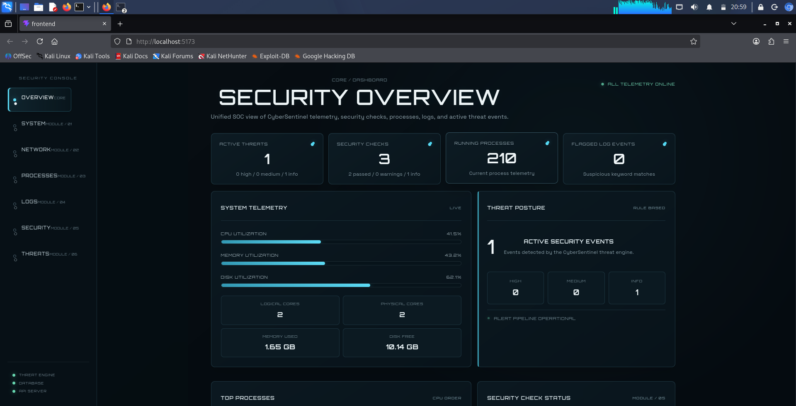
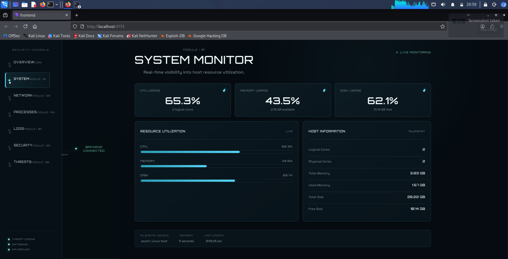
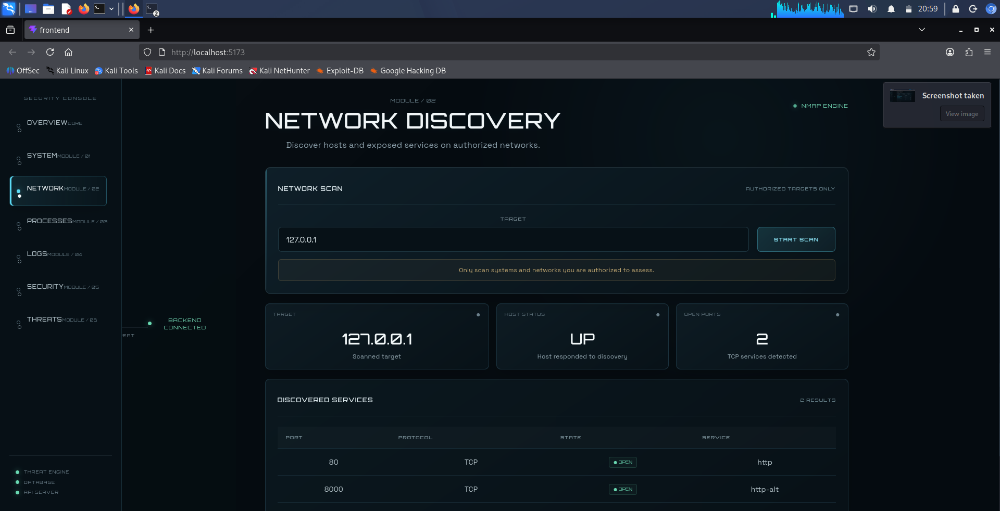
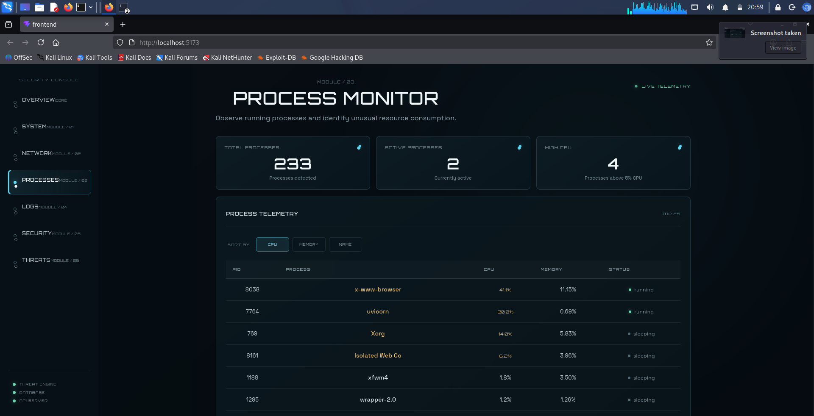
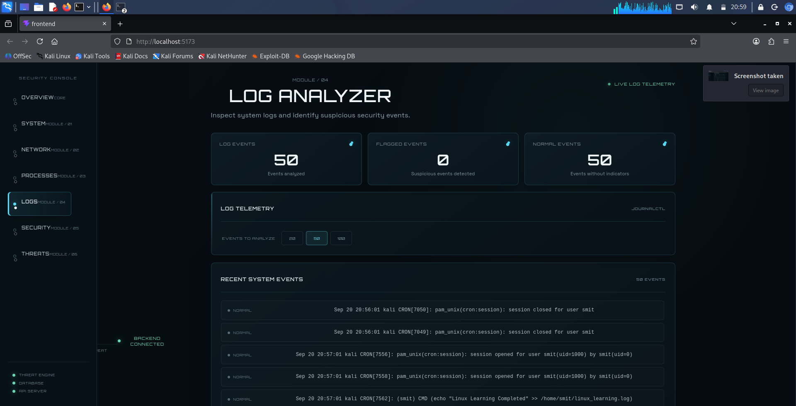
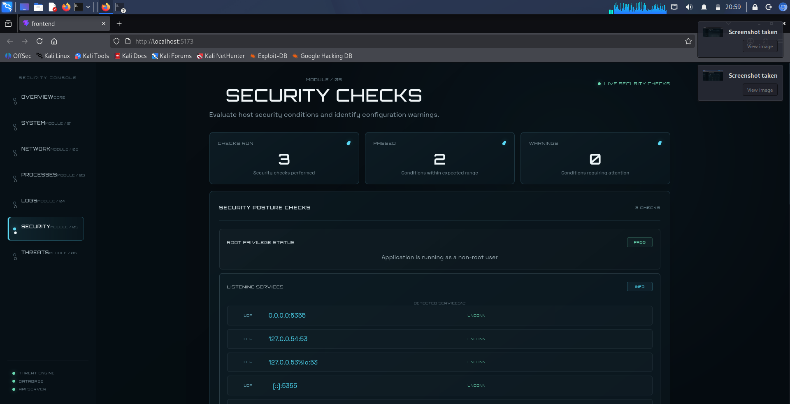
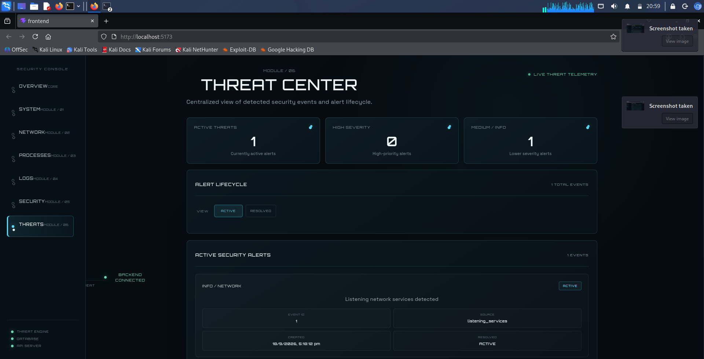

# CyberSentinel

CyberSentinel is a defensive cybersecurity monitoring and threat-analysis platform designed to provide a centralized view of host telemetry, network exposure, system logs, security checks, and detected security events.

The project combines a Python FastAPI backend with a React-based SOC-style dashboard and SQLite alert persistence.

---

## Features

### 1. System Monitoring

Provides live host resource telemetry using `psutil`.

Monitored metrics include:

- CPU utilization
- Logical and physical CPU cores
- Memory usage
- Available memory
- Disk usage
- Free disk space

### 2. Process Monitoring

Collects information about running processes on the monitored Linux system.

Displayed information includes:

- Process ID
- Process name
- CPU utilization
- Memory utilization
- Process status
- Active-process classification
- High-CPU classification

### 3. Network Discovery

CyberSentinel integrates with Nmap to perform authorized network discovery.

The current scanner supports individual IP addresses and reports the target address, host availability, discovered ports, protocol, port state, detected service, and Nmap return status.

Example local target: `127.0.0.1`

### 4. Log Analyzer

The log analyzer retrieves recent system events through `journalctl`.

It supports configurable event counts of 20, 50, and 100 events. Log entries are analyzed for predefined indicators such as error-related keywords and classified as flagged or normal events.

### 5. Security Checks

CyberSentinel performs host-level security posture checks:

- Root privilege status
- Listening network services
- Disk usage

Results use statuses such as PASS, INFO, and WARNING.

### 6. Threat Engine

The threat engine converts selected security-check results into structured security alerts.

Current alert rules include:

- Root privilege warning → high severity
- High disk usage → medium severity
- Listening network services → informational network alert

### 7. Alert Persistence

Detected alerts are stored in SQLite. The alert lifecycle supports active alerts, resolved alerts, alert history, active-alert deduplication, and resolution of alerts that are no longer detected.

### 8. SOC Dashboard

The React frontend provides a centralized dashboard containing:

- Security overview
- System monitoring
- Network discovery
- Process monitoring
- Log analysis
- Security checks
- Threat center

---

## Architecture

```text
                    Linux Host
                        |
        +---------------+---------------+
        |               |               |
      psutil          journalctl       ss
        |               |               |
 System Monitor    Log Analyzer   Security Checks
        |
 Process Monitor

                 Nmap
                   |
           Network Discovery
                   |
                   v

              FastAPI Backend
                   |
             Threat Engine
                   |
                SQLite
                   |
                   v
             React Dashboard
                   |
             SOC Interface
```

---

## Technology Stack

| Component | Technology |
|---|---|
| Operating System | Kali Linux |
| Backend | Python |
| API Framework | FastAPI |
| System Monitoring | psutil |
| Network Discovery | Nmap |
| Log Collection | journalctl |
| Security Service Inspection | ss |
| Database | SQLite |
| Frontend | React |
| Build Tool | Vite |
| Testing | pytest |
| Version Control | Git / GitHub |

---

## Project Structure

```text
CyberSentinel/
├── backend/
│   ├── app/
│   │   ├── main.py
│   │   ├── system_monitor.py
│   │   ├── process_monitor.py
│   │   ├── network_scanner.py
│   │   ├── log_analyzer.py
│   │   ├── security_checks.py
│   │   ├── threat_engine.py
│   │   └── database.py
│   ├── requirements.txt
│   └── venv/
├── frontend/
├── tests/
├── screenshots/
├── docs/
├── scripts/
├── .gitignore
└── README.md
```

---

## Installation

Clone the repository:

```bash
git clone https://github.com/smittt03/CyberSentinel.git
cd CyberSentinel
```

### Backend Setup

```bash
cd backend
python3 -m venv venv
source venv/bin/activate
pip install -r requirements.txt
```

### Frontend Setup

Open another terminal:

```bash
cd frontend
npm install
```

---

## Running CyberSentinel

### Start the Backend

```bash
cd ~/CyberSentinel/backend
source venv/bin/activate
uvicorn app.main:app --reload --host 127.0.0.1 --port 8000
```

Backend: `http://127.0.0.1:8000`

### Start the Frontend

In another terminal:

```bash
cd ~/CyberSentinel/frontend
npm run dev
```

Dashboard: `http://localhost:5173`

---

## API Endpoints

| Endpoint | Purpose |
|---|---|
| `GET /` | Project status |
| `GET /health` | Health check |
| `GET /api/system` | System telemetry |
| `GET /api/processes` | Process telemetry |
| `GET /api/network/scan` | Nmap network scan |
| `GET /api/logs` | Recent system log events |
| `GET /api/security/checks` | Security posture checks |
| `GET /api/security/alerts` | Active security alerts |
| `GET /api/alerts` | Alert history |

Example:

```text
http://127.0.0.1:8000/api/network/scan?target=127.0.0.1
```

---

## Testing

CyberSentinel uses pytest for automated backend testing.

Run:

```bash
cd ~/CyberSentinel
source backend/venv/bin/activate
pytest -q
```

Current verification:

```text
61 passed
```

The test suite covers API behavior, process monitoring, network scanning, log analysis, security checks, threat generation, alert persistence, and alert lifecycle behavior.

---

## Frontend Production Build

```bash
cd ~/CyberSentinel/frontend
npm run build
```

The Vite production build has been successfully verified.

---

## Screenshots

### Security Overview



### System Monitor



### Network Discovery



### Process Monitor



### Log Analyzer



### Security Checks



### Threat Center



---

## Security Scope

CyberSentinel is intended for defensive monitoring and authorized security assessment.

Network discovery should only be performed against systems and networks for which the user has explicit authorization.

The project does not perform exploitation or unauthorized access.

---

## Limitations

Current limitations include:

- Network scanning currently accepts individual IP addresses rather than arbitrary network ranges.
- Threat detection uses predefined rules rather than machine-learning models.
- Log analysis currently uses keyword-based indicators.
- The platform is primarily designed for local Linux host monitoring.
- No automated remediation actions are currently implemented.
- Listening-service results currently provide endpoint information rather than complete service ownership analysis.

---

## Future Enhancements

Potential future improvements include:

- CIDR/network-range discovery
- More advanced log correlation
- Additional security posture checks
- Process-to-network-service correlation
- Configurable detection rules
- Role-based authentication
- Remote host monitoring
- Notification integrations
- Advanced threat correlation
- Machine-learning-assisted anomaly detection
- Containerized deployment

---

## Project Status

CyberSentinel's core monitoring, analysis, threat detection, persistence, and dashboard modules have been implemented and tested.

The current backend test suite contains **61 passing tests**, and the frontend production build has been successfully verified.

---

## License

This project was developed as an academic and defensive cybersecurity project.
